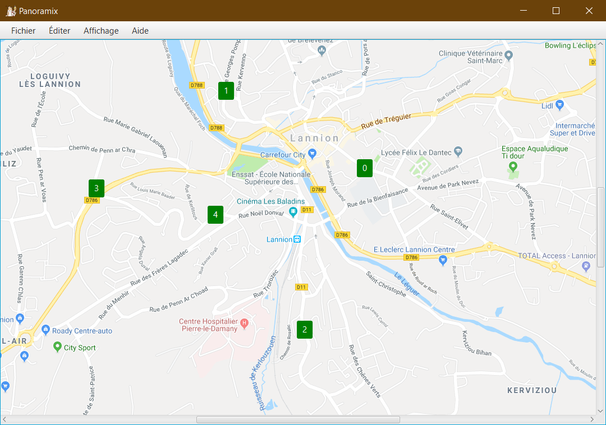

# Panoramix, gestionnaire de panneaux publicitaires 🗺️
Logiciel de gestion de panneaux publicitaires créé dans le cadre du projet de première année de DUT Informatique à l'IUT de Lannion.



## Développeurs 👨‍💻
- [Killian Monnier](https://github.com/paraceltus)
- [Kilian Le Borgne](https://github.com/kleborgn)
- [Evan Scoarnec](https://github.com/EvanScoarnec)
- [Mathis Lardeux](https://github.com/mathislardeux)
- [Guénaël Rivoal](https://gitlab.com/Guenael.Rivoal)

## Utilisation 💻
À écrire dans la console
```
java -jar Panoramix.jar
```

## Documentation 📚
- [Tutorials on Youtube](https://www.youtube.com/)
- [Docs on Oracle JavaFX](https://docs.oracle.com/javase/8/javafx/api/toc.htm)
- [Issues on StackOverflow](https://stackoverflow.com/questions)
- [Explains on Java Developpez](https://java.developpez.com/)
